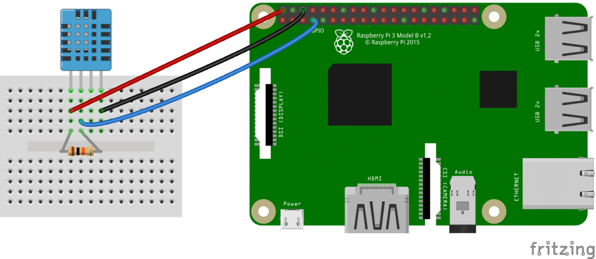

# The problem :

Today, more and more frauds related to non-compliance with the cold chain are identified through the high number of food poisoning and deaths each year.
In France alone, according to the Revue de la santé Publique, there are 2.2 million cases of food poisoning per year, including 17,000 hospitalizations and more than 200 deaths annually.

Breaking this chain therefore involves risks. In fact, the rise in temperature may lead to the proliferation of certain germs (salmonella, staphylococcus aureus, listeria monocytogens, etc.) and then render the product unfit for consumption.

# My Solution :
In order to remedy this lack of transparency and respect for health protocols on the part of the parties concerned, a solution to the problem has been devised:


<br></br>


### Mongodb ATLAS :
I used mongodb ATLAS to store root data related to my sensor data ,you have to configure your details in both directory :

```
nodejs-application/.env 
raspberrypi/.env
```
And fill it with your credentials:
```
MONGO_ATLAS_USERNAME = my_username
MONGO_ATLAS_PW=   my_password
MONGO_ATLAS_CLUSTER=  my_cluster
```

Or connect it to a local Mongodb Database.


### RaspberryPI :
Copy the rapsberrypi folder to your PI and connect to it:
```
scp -r myapp/raspberrypi/ pi@<ip_address>:/home/pi
ssh pi@<ip_address>
```

I used a pi 3 with 2GB of RAM connected with DTH11 Sensor through  ```GPIO 4```
<br></br>


```
# First update your pi
sudo apt-get update

# Change directory to raspberrypi
cd ~/pi/raspberrypi 

# Install NPM dependencies for raspberrypi 
npm install 

# Send data to the Tangle
node mam_API/send_mam.js
```
### nodejs-application :

On your local machine ,run :
```
# Change directory to nodejsapplication 
cd myapp/nodejs-application  

# Install NPM dependencies for nodejs-application 
npm install

# Then simply start your app
npm start

you can check website will be up and running on localhost at 3000 port.
http://localhost:3000
```

## Prerequisites : 

you need to install following software 
1)	Nodejs https://nodejs.org/en/download/
2)	Express setup in nodejs application using pug template
3)	Mongodb
5)	IOTA  MAM API https://iota.org/


## Project Structure :
### nodejsapplication :
Name | Description
-- | --
bin/ | create server and normalize port
db/ | Mongodb connection + IOTA MAM Fetch
fetch_data.js | fetch sensor data using root stored in mongodb ATLAS 
public/ | Static assets (css, img etc)
public/styleshees/style.css | Main stylesheet for your app
routes/ | controller for different routes
routes/charts.js | controller for display line charts  
routes/index.js | controller for navigation bar
views/ | Templates
views/dashboard | Dashboard related templates
views/dashbaord/temperature.pug | Display line chart
views/dashbaord/humidity.pug | Display line chart
views/partials/about.pug | About page(rendering test)
views/error.pug |  Template for error messages
views/partials/navbar.pug | Navbar partial template.
views/layout.pug | Base template.
app.js | The main application file.

### raspberrypi :
Name | Description
-- | --
mam_API/ | POST request to the tangle-chain and Mongodb ATLAS  
send_mam.js | send real time sensor data to the tangle and Mongodb ATLAS
sensors/ | sensors scripts  repository 
dht11.js | asynchronous function piped to the send_mam.js file

### environment file :
Name | Description
-- | --
.env | configuration file for environment variables


<details>
  <summary>How to start contributing</summary>
  
1. Fork the [repository](https://github.com/backdrop/backdrop.git).

2. Clone the forked repository and configure the upstream remote:

```sh
git clone https://github.com/<your username>/backdrop.git
cd backdrop
git remote add upstream https://github.com/backdrop/backdrop.git
```

3. Fetch the updates from the upstream branch and synchronize with the local `1.x` branch:

```sh
git fetch upstream
git checkout 1.x
git merge upstream/1.x
```
4. Create a new branch:

```sh
git checkout -b my-new-branch
```

5. Make changes to the code, then commit the changes and push to the forked repo:

```sh
git add .
git commit -m "This is my first commit"
git push -u origin my-new-branch
```

6. Go to [the repository](https://github.com/backdrop/backdrop.git) and link a Pull Request to the issue.

After reviewing the pull request, we will provide you with feedback, request further changes and approve the PR to merge the work.

</details>
